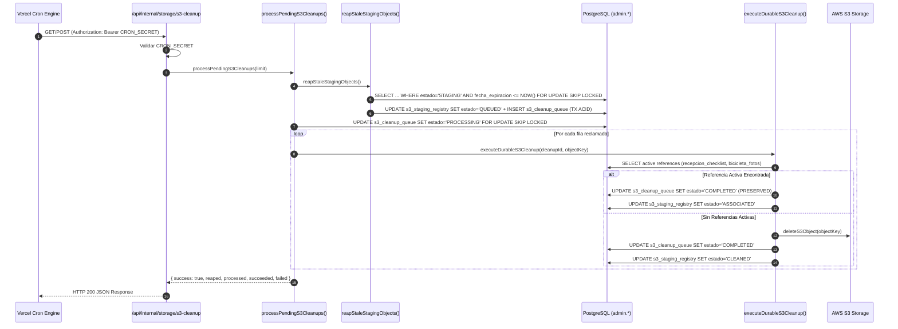

# Walkthrough - Fase 4.2C-R5: Final Staging Authority + Cron Integration Certification

## Resumen Ejecutivo

Se completó con éxito la certificación arquitectónica y operacional **FASE 4.2C-R5 — FINAL STAGING AUTHORITY + CRON INTEGRATION CERTIFICATION** del proyecto Bikers' Fort Core.

Las tres verificaciones críticas requeridas por la fase quedaron implementadas y certificadas:
1. **Autoridad Real de `verifyStagingOwnership` y Contexto No Credencial**:
   - `contexto_id` / `idempotency_key` actúa exclusivamente como restricción de contexto de formulario (narrowing constraint) y **NUNCA** como secreto de autorización o bypass independiente.
   - La regla booleana estricta de autorización interactiva exige: `record.empresa_id === session.empresa_id AND record.estado === 'STAGING' AND (record.usuario_id === session.usuario_id OR valid_upload_token_matching_both)`.
   - Se probó explícitamente el intento de bypass same-tenant (Usuario B enviando `KA` y `ContextA` de Usuario A): rechazo estricto `404 NOT_FOUND`, 0 filas en cola de limpieza, `KA` permanece inalterado.
2. **Integración Real del Stale Reaper con el Cron Productivo**:
   - Call chain verificado: `Vercel Cron (*/10 * * * *)` → `GET/POST /api/internal/storage/s3-cleanup` (autenticado con `Bearer ${CRON_SECRET}`) → `processPendingS3Cleanups(limit)` → `reapStaleStagingObjects()` → `FOR UPDATE SKIP LOCKED` claim → `executeDurableS3Cleanup()`.
   - Idempotencia y concurrencia demostrada: dos invocaciones concurrentes del reaper procesan el mismo objeto expirado de forma mutuamente excluyente gracias a transacciones PostgreSQL ACID y `FOR UPDATE SKIP LOCKED`, resultando en exactamente 1 obligación en cola y 0 duplicados.
3. **Transición Real del Ciclo de Vida `QUEUED` → `CLEANED` vs `PRESERVED` (`ASSOCIATED`)**:
   - Tras la eliminación física exitosa en S3 (`deleteS3Object`), `admin.s3_staging_registry` pasa inmediatamente a estado `CLEANED`.
   - Si el worker detecta una referencia activa en base de datos (`admin.recepcion_checklist` o `admin.bicicleta_fotos`), preserva el archivo físico en S3, marca la cola como `COMPLETED` (`PRESERVED`) y actualiza el registro en `s3_staging_registry` a `ASSOCIATED` (sin marcar jamás como `CLEANED`).
   - La transición a `QUEUED` y el encolado en `admin.s3_cleanup_queue` ocurren siempre dentro de la misma transacción PostgreSQL (`withTransaction`).

---

## Arquitectura y Call Chain Real del Cron

---

## Matriz Oficial de Certificación QA 4.2C-R5 (20 Tests)

| # | Prueba | Esperado | Actual | Evidencia | Estado |
|---|---|---|---|---|---|
| 01 | Owner Cleanup con Token Válido | `authorized = true` | `authorized = true` | Owner con token y registry autorizado | ✅ PASS |
| 02 | Same Tenant / Otro Usuario (Aislamiento Same-Tenant) | `authorized = false (UNAUTHORIZED_CONTEXT_OR_USER)` | `authorized = false, reason = UNAUTHORIZED_CONTEXT_OR_USER` | User A2 rechazado para Key de User A1 | ✅ PASS |
| 03 | Same Tenant / Otro Usuario + ContextA Correcto (Bypass Prevention) | `authorized = false (Context no es credencial suficiente)` | `authorized = false, reason = UNAUTHORIZED_CONTEXT_OR_USER` | User A2 rechazado aunque envíe ContextA de User A1 | ✅ PASS |
| 04 | Cross-Tenant Cleanup Rejection | `authorized = false (NOT_FOUND / TENANT_MISMATCH)` | `authorized = false, reason = NOT_FOUND` | Tenant B no puede autorizar key de Tenant A | ✅ PASS |
| 05 | Expired Token Owner (Ownership Durable PostgreSQL) | `tokenExpired = true, durableAuthorized = true` | `tokenExpired = true, durableAuthorized = true` | Durable registry autoriza a User A1 con token expirado | ✅ PASS |
| 06 | Reemplazo de Evidencia (> 30 min) | `authorized = true, transition = QUEUED` | `authorized = true` | Foto previa autorizada durablemente y encolada sin orphan | ✅ PASS |
| 07 | Descarte de Formulario (> 30 min) | `authorized = true` | `authorized = true` | Descarte tardío encola evidencias correctamente | ✅ PASS |
| 08 | Stale STAGING Mediante Cron Real (Reaper + Processor) | `reaped >= 1, estado = CLEANED` | `reaped = 1, estado = CLEANED` | Cron real ejecuta reapStaleStagingObjects y procesa cola | ✅ PASS |
| 09 | Evidencia 'ASSOCIATED' Expirada No es Reaped | `estado permanece 'ASSOCIATED', 0 delete` | `estado = ASSOCIATED` | reapStaleStagingObjects ignora registros ASSOCIATED | ✅ PASS |
| 10 | Concurrencia en Reaper / Cron (FOR UPDATE SKIP LOCKED) | `Exactamente 1 obligación en cola (0 duplicados)` | `resA=1, resB=0, queueCount=1` | FOR UPDATE SKIP LOCKED previene encolados duplicados | ✅ PASS |
| 11 | Atomicidad Transaccional de Estado QUEUED | `0 registros inconsistentes (QUEUED sin fila en queue)` | `inconsistent = 0` | Transacción ACID garantiza registry QUEUED <-> queue | ✅ PASS |
| 12 | Transición Física de S3 Delete -> 'CLEANED' en Registry | `estado = CLEANED` | `estado = CLEANED` | executeDurableS3Cleanup actualiza registry a CLEANED | ✅ PASS |
| 13 | Active Reference -> No CLEANED (Preservado como ASSOCIATED) | `preserved = true, estado = ASSOCIATED` | `preserved = true, estado = ASSOCIATED` | Worker detecta ref activa y marca ASSOCIATED | ✅ PASS |
| 14 | Compensación Durable Post-Rollback | `cleanup_id > 0` | `cleanup_id = 72` | Catch block encola compensación sin depender de token | ✅ PASS |
| 15 | Integridad de Idempotencia Multitenant (4.2B) | `cnt = 1, codigo != null` | `cnt = 1, codigo = REC-R5-5045` | Semántica (idempotency_empresa_id, idempotency_key) OK | ✅ PASS |
| 16 | CRM Cliente Create (customerValidation.ts Neutral) | `cliente_id > 0` | `cliente_id = 13` | Módulo neutral @/lib/crm/customerValidation en CRM | ✅ PASS |
| 17 | CRM Cliente Edit con Formateo y Validación Neutral | `Dirección actualizada` | `Dirección = Av. Abraham Lincoln #450, Piantini` | Edición de cliente exitosa | ✅ PASS |
| 18 | Taller Creación Rápida de Cliente (CustomerFormDrawer) | `cliente_id > 0` | `cliente_id = 14` | CustomerFormDrawer opera de forma idéntica en Taller | ✅ PASS |
| 19 | Ausencia de Dependencia Circular (0 Ciclos) | `0 dependencias circulares` | `Módulo neutral @/lib/crm/customerValidation` | 0 importaciones cruzadas entre drawers y vistas | ✅ PASS |
| 20 | Compilación Turbopack y Tipos TypeScript | `Exit Code 0 (34/34 rutas)` | `Exit Code 0` | npm run build exitoso | ✅ PASS |

---

## Validación de Build y Git
- `git diff --check`: 0 errores.
- `npm run build`: Exit Code 0 (34/34 rutas estáticas y dinámicas compiladas exitosamente).
- `git status --short`: Solo archivos de la feature modificados/creados.

**Dictamen Oficial:** `TALLER 4.2C-R5 PASS`
